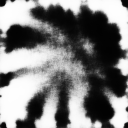

# E2ETag
E2ETag: An End-to-End Trainable Method for Generating and Detecting Fiducial Markers 
Link to our paper: https://www.bmvc2020-conference.com/assets/papers/0890.pdf  

## Description
E2ETag proposes an end-to-end trainable method for designing, detecting, and enabling fiducial markers with deep learning.  Our method is made possible by introducing back-propagatable marker augmentation and superimposition into training.  The detector used was a modified DeepLabV3+ encoder which predicts marker's localization, projective pose, and class.  The images used for superimposition training were from the ImageNet dataset.  Results demonstrate that our method outperforms existing fiducial markers in ideal conditions and especially in the presence of motion blur, contrast fluctuations, noise, and off-axis viewing angles.  

## Trained Markers (30 Classes)
      
      
      
      
      
      

## Sample Detection Visualizations
  

  

## Citation
If you find our work useful in your research, please consider citing:

	@article{peace2020e2etag,
	  title={E2ETag: An End-to-End Trainable Method for Generating and Detecting Fiducial Markers},
	  author={J. Brennan Peace and Eric Psota and Yanfeng Liu and Lance C. Pérez},
	  journal={The 31st British Machine Vision Conference (BMVC)},
	  year={2020}
	}
